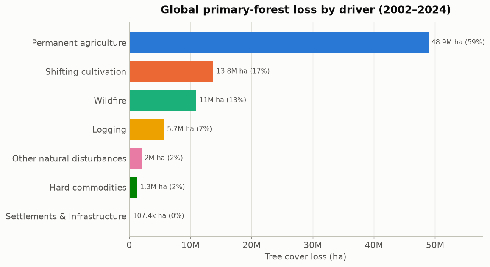

# simple_eda

The simplest exploratory-data-analysis API. One import, one call.

```python
import simple_eda as eda

eda.summarize(df)
```

## Install

```bash
pip install -e .
```

## Usage

```python
import pandas as pd
import simple_eda as eda

df = pd.DataFrame({
    "name": ["Ana", "Bo", None],
    "age": [25, None, 31],
})
print(eda.summarize(df))
print(eda.missing(df))
```

## Core functions

- **`summarize(df)`** — shape, columns, and dtypes (as a dict)
- **`missing(df)`** — null count per column, most-missing first (a Series)
- **`numeric_columns(df)`** — names of the numeric columns (a list)
- **`categorical_columns(df)`** — names of the object/category columns (a list)

## Scope (MVP)

Input is **pandas DataFrames only**. Polars, Spark, Dask, and Arrow are not
supported yet — fewer choices means fewer bugs.

---

# forest_viz

A small visualization library for **Global Forest Watch** tree-cover-loss
data, focused on **tree cover loss over time** and the **primary drivers**
of that loss.

## Install

```bash
pip install -e ".[viz]"     # adds matplotlib + openpyxl
```

## Usage

```python
from forest_viz import data, plots, theme

# Load and tidy the GFW workbook (wide year columns -> long format)
tcl = data.load_tree_cover_loss("data/raw/global.xlsx")          # country, year, tc_loss_ha
drivers = data.load_drivers("data/raw/global.xlsx", primary=True) # country, driver, year, tc_loss_ha

theme.apply_theme()                       # recessive grid, sans type; theme.apply_theme(dark=True) for dark
plots.plot_loss_trend(tcl)                # annual loss, global (or country="Brazil")
plots.plot_top_countries(tcl, n=15)       # ranked bar
plots.plot_drivers_over_time(drivers)     # stacked area by driver
plots.plot_driver_composition(drivers)    # ranked bar, share per driver
```

Every plot function takes a tidy frame, draws on a matplotlib `Axes`
(making one if none is passed), and returns it — so you can compose them
into subplots or save with `ax.figure.savefig(...)`.

Regenerate the example figures below from the workbook:

```bash
python examples/generate_figures.py data/raw/global.xlsx
```

## Charts

| Function | Question it answers | Form |
|---|---|---|
| `plot_loss_trend` | How has annual tree-cover loss changed? | area + line, peak labeled |
| `plot_top_countries` | Which countries lost the most? | ranked horizontal bar |
| `plot_drivers_over_time` | How does the driver mix shift year to year? | stacked area |
| `plot_driver_composition` | Which drivers dominate overall? | ranked bar, % share |





## Design

Colors come from a colorblind-safe, fixed-order categorical palette
(validated for CVD separation and contrast in light **and** dark modes).
Each driver is bound to a fixed color, so filtering or reordering never
repaints a series; multi-series charts always carry a legend and bars carry
direct value labels.

## Data notes

- Driver sheets are published at the 30% canopy-density `threshold` only, so
  the loaders default to `threshold=30`.
- Tree-cover-loss years run 2001–2025; primary-driver years run 2002–2025.
- 2025 is a partial year in the source data — expect a drop at the tail.
- The raw 18 MB workbook is **not** committed (see `.gitignore`); small tidy
  CSVs under `data/processed/` are, for reproducibility.

## Project layout

```
visualization_library/
├── src/
│   ├── simple_eda/          # the tiny EDA helper (above)
│   │   ├── __init__.py
│   │   └── core.py
│   └── forest_viz/          # the GFW visualization library
│       ├── __init__.py
│       ├── data.py          # load + tidy the workbook
│       ├── palette.py       # validated driver colors
│       ├── theme.py         # matplotlib theme
│       └── plots.py         # the four chart functions
├── examples/generate_figures.py
├── data/processed/          # small tidy CSVs (committed)
├── reports/figures/         # example PNGs
├── tests/
├── README.md
├── pyproject.toml
└── LICENSE
```
