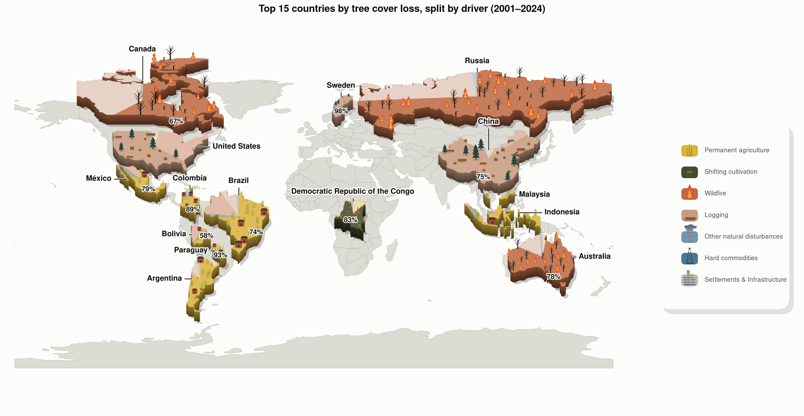
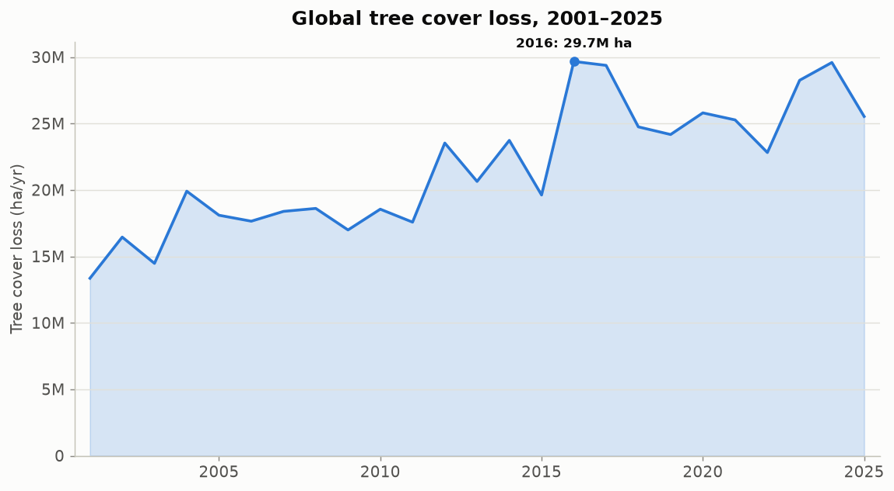
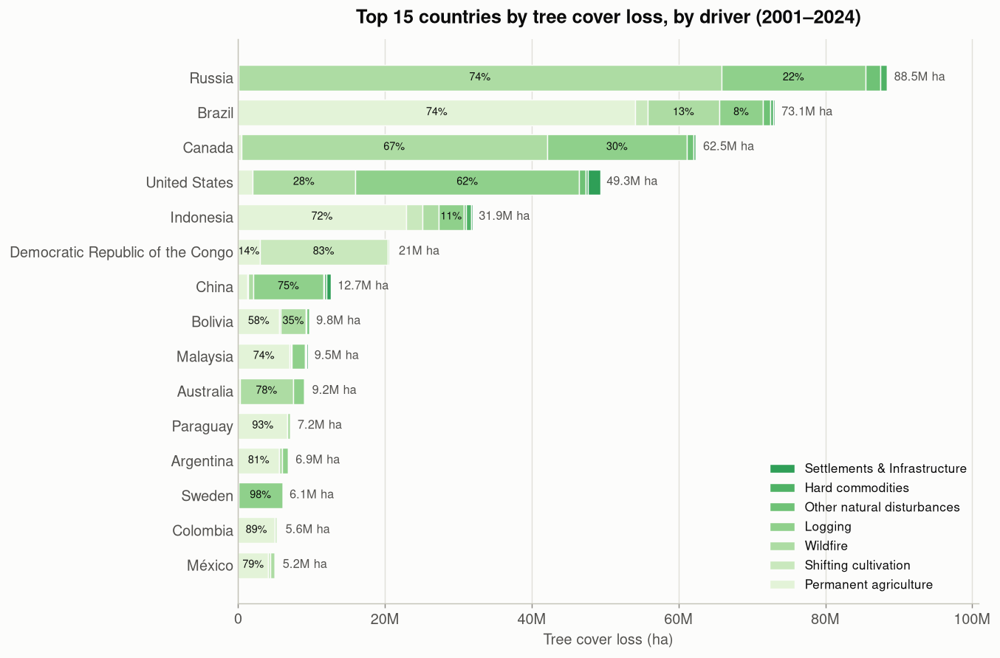
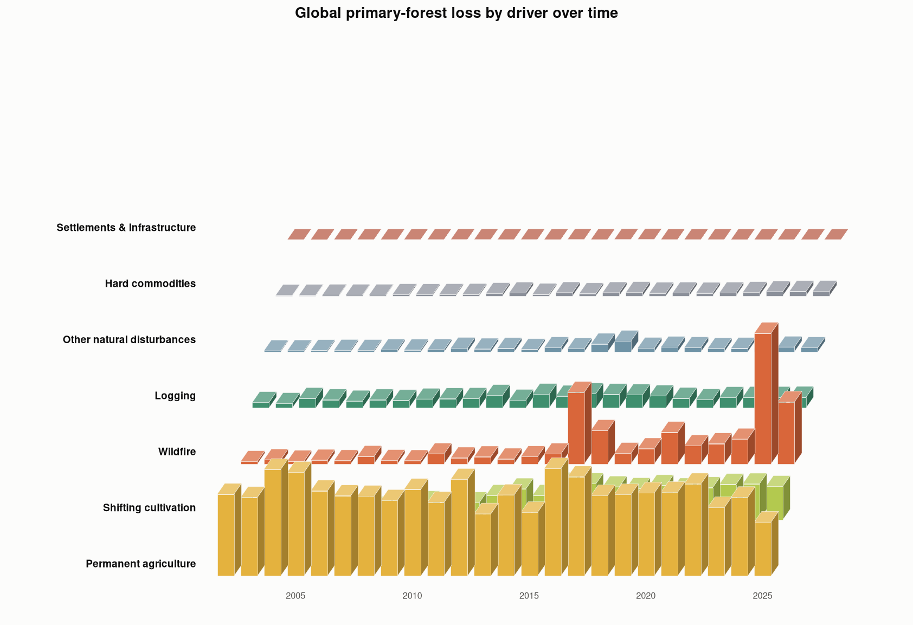
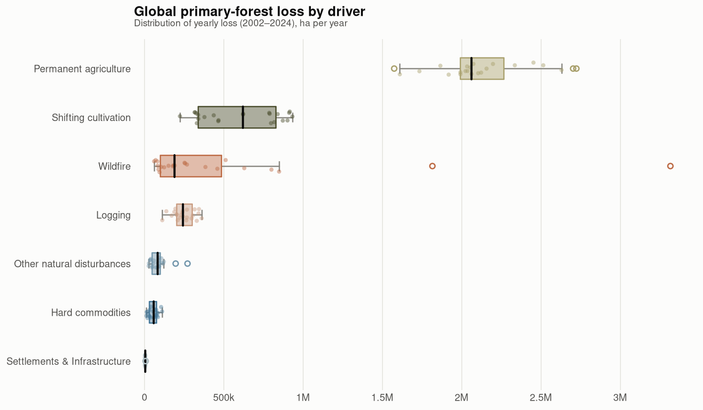
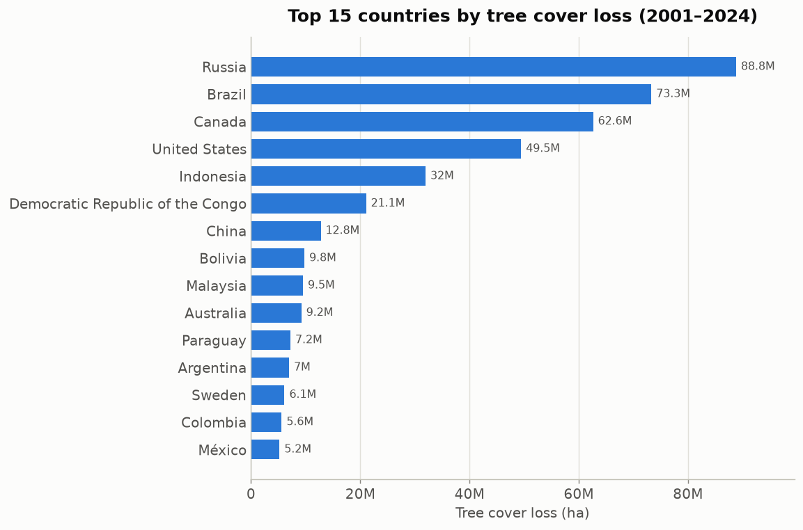

# simple_eda

The simplest exploratory-data-analysis API. One import, one call.

```python
import simple_eda as eda

eda.summarize(df)
```

## Install

```bash
pip install -e .
```

## Usage

```python
import pandas as pd
import simple_eda as eda

df = pd.DataFrame({
    "name": ["Ana", "Bo", None],
    "age": [25, None, 31],
})
print(eda.summarize(df))
print(eda.missing(df))
```

## Core functions

- **`summarize(df)`** — shape, columns, and dtypes (as a dict)
- **`missing(df)`** — null count per column, most-missing first (a Series)
- **`numeric_columns(df)`** — names of the numeric columns (a list)
- **`categorical_columns(df)`** — names of the object/category columns (a list)

## Scope (MVP)

Input is **pandas DataFrames only**. Polars, Spark, Dask, and Arrow are not
supported yet — fewer choices means fewer bugs.

---

# forest_viz

A small visualization library for **Global Forest Watch** tree-cover-loss
data, focused on **tree cover loss over time** and the **primary drivers**
of that loss.

## Install

```bash
pip install -e ".[viz]"     # adds matplotlib + openpyxl
```

## Usage

```python
from forest_viz import data, plots, theme

# Load and tidy the GFW workbook (wide year columns -> long format)
tcl = data.load_tree_cover_loss("data/raw/global.xlsx")          # country, year, tc_loss_ha
drivers = data.load_drivers("data/raw/global.xlsx", primary=True) # country, driver, year, tc_loss_ha

all_drivers = data.load_drivers("data/raw/global.xlsx", primary=False)  # all TC loss

theme.apply_theme()                              # recessive grid, sans type; dark=True for dark
plots.plot_loss_trend(tcl)                       # annual loss, global (or country="Brazil")
plots.plot_top_countries(tcl, n=15)              # ranked bar
plots.plot_top_countries_drivers(all_drivers)    # ranked bar split into driver % shares
maps.plot_drivers_over_time_3d(drivers)          # layered 3-D bar graphs per driver
plots.plot_driver_box(drivers)                   # box-and-whisker of annual loss per driver
```

Every plot function takes a tidy frame, draws on a matplotlib `Axes`
(making one if none is passed), and returns it — so you can compose them
into subplots or save with `ax.figure.savefig(...)`.

Regenerate the example figures below from the workbook:

```bash
python examples/generate_figures.py data/raw/global.xlsx
```

## Charts

| Function | Question it answers | Form |
|---|---|---|
| `plot_loss_trend` | How has annual tree-cover loss changed? | area + line, peak labeled |
| `plot_top_countries` | Which countries lost the most? | ranked horizontal bar |
| `plot_top_countries_drivers` | For the top countries, what % of loss is which driver? | ranked bar, stacked by driver with % labels |
| `plot_top_countries_map` | Where are the top countries, and their driver mix? | pop-out world map, each country filled by driver share |
| `plot_drivers_over_time_3d` | How does the driver mix shift year to year? | isometric pictograph — columns of driver motifs (ha axis) |
| `plot_driver_box` | How does each driver's annual loss vary? | horizontal box-and-whisker |








### Pop-out map

`plot_top_countries_map` lifts the top-N countries off a muted base map
with a drop shadow and 3-D extrusion (as if pulled out), at their true
geographic proportions relative to the rest of the map (`enlarge=1.0`;
raise it to exaggerate the highlighted countries). Each country's own
shape is sliced into pie wedges sized by each driver's share of that
country's loss, extruded into a 3-D slab (shaded side wall + top face) so
they read as solid, clearly distinguishable blocks. Bordering countries are
pushed apart so a clear gap separates them, and tiny outlying islands are
dropped (e.g. Alaska) for clean silhouettes.

Secondary drivers are colored in consistent muted **pastel-green shades**
(each driver keeps its shade everywhere). Each country's **primary driver**
is styled like the reference infographic instead: its sector takes a themed
**biome color** — crop gold (permanent agriculture), ember orange
(wildfire), forest teal (logging), olive (shifting cultivation), brick
(settlements), etc. — and is filled with a little **diorama** composed from
a *set* of flat vector motifs (`forest_viz.motifs`) at varied sizes and
jittered positions, drawn back-to-front for depth (e.g. wildfire = conifers
+ round trees + flames; logging = trees + logs + stumps; agriculture = crop
rows + a barn; shifting cultivation = seedlings + sprouts + flames). The
motifs are simple silhouettes in a cohesive muted palette (no external
images). The element count scales with the share, and the layout is
deterministic per country. The 3-D slab's side wall follows the theme
color; the legend keys each driver's pastel-green shade.
If two drivers are within ~5 points of each other (an effective tie), both
are treated as primary. Icons are Microsoft Fluent Emoji (MIT-licensed),
bundled under `src/forest_viz/assets/icons/`.

`enlarge`, `gap`, `depth`, `island_min_frac`, and `icon_scale` are tunable.
Geometry is a bundled Natural Earth 110m GeoJSON; no geopandas required.

```python
from forest_viz import data, maps, theme
all_drivers = data.load_drivers("data/raw/global.xlsx", primary=False)
theme.apply_theme()
maps.plot_top_countries_map(all_drivers, "data/geo/ne_110m_admin_0_countries.geojson", n=15)
```

## Design

Colors come from a colorblind-safe, fixed-order categorical palette
(validated for CVD separation and contrast in light **and** dark modes).
Each driver is bound to a fixed color, so filtering or reordering never
repaints a series; multi-series charts always carry a legend and bars carry
direct value labels.

## Data notes

- Driver sheets are published at the 30% canopy-density `threshold` only, so
  the loaders default to `threshold=30`.
- Tree-cover-loss years run 2001–2025; primary-driver years run 2002–2025.
- 2025 is a partial year in the source data — expect a drop at the tail.
- The raw 18 MB workbook is **not** committed (see `.gitignore`); small tidy
  CSVs under `data/processed/` are, for reproducibility.

## Project layout

```
visualization_library/
├── src/
│   ├── simple_eda/          # the tiny EDA helper (above)
│   │   ├── __init__.py
│   │   └── core.py
│   └── forest_viz/          # the GFW visualization library
│       ├── __init__.py
│       ├── data.py          # load + tidy the workbook
│       ├── palette.py       # validated driver colors
│       ├── theme.py         # matplotlib theme
│       ├── plots.py         # bar/area/line chart functions
│       └── maps.py          # pop-out world map
├── examples/generate_figures.py
├── data/processed/          # small tidy CSVs (committed)
├── data/geo/                # Natural Earth countries GeoJSON (committed)
├── reports/figures/         # example PNGs
├── tests/
├── README.md
├── pyproject.toml
└── LICENSE
```
